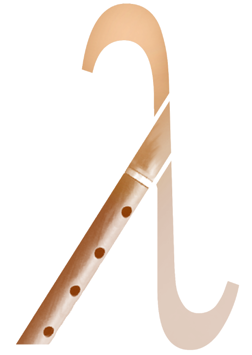

## Shvi 🪈. Lisp-Inspired Sound Synthesis Language

**Overview:**

**Shvi** (Armenian woodwind instrument - շվի) is a minimalist, Lisp-like programming language tailored for sound generation and audio experimentation.

**Features:**

* **Lisp Foundations:** Shvi supports all the classic Lisp constructs: `let`, `lambda`, `setf`, higher-order functions, recursion, and first-class code-as-data.
* **Audio Primitives:** Built-in functions like `tone`, `sequence`, `repeat`, and others let you generate and manipulate sound in a structured and programmable way.

---

**Example 1: Frequency Sweep**

```lisp
(let ((freq 100)) ;; set initial frequency to 100

  ;; repeat the sequence 100 times
  (repeat 100 (sequence  
    ;; play freq tone for 100 ms
    (tone freq 100)
    (print freq)

    ;; add 10 to freq
    (setf freq (+ freq 10))
  ))

)
```

Generates a rising tone sequence by incrementing the frequency by 10 Hz every 100 milliseconds, printing the current frequency each time.

---

**Example 2: Higher-Order Functions**

```lisp
;; ((λx.(λy.x^2+y^2))(5))(2) = 29 in Shvi

(let
  ((fn (lambda (x) (lambda (y) (+ (* x x) (* y y))))))
  
  (print ((fn 5) 2)) ;; should print 29
)
```
